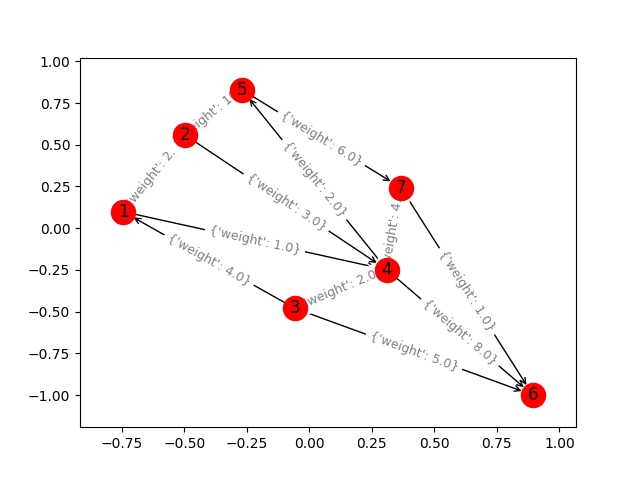

# Dijkstra algorithm

## Finding shortest path in a graph

Implemented algorithm is based in [Wikipedia pseudocode](https://en.wikipedia.org/wiki/Dijkstra%27s_algorithm#Algorithm)

## How to run it?
1. Create and activate Python3 virtualenv
```
? python3 -m virtualenv ENV
...
Installing setuptools, pip, wheel...done.

? source ENV/bin/activate

```
2. Install dependencies
```
? pip install -r requirements.txt
pip install -r requirements.txt
Collecting cycler==0.10.0 (from -r requirements.txt (line 1))
  Using cached https://files.pythonhosted.org/packages/f7/d2/e07d3ebb2bd7af696440ce7e754c59dd546ffe1bbe732c8ab68b9c834e61/cycler-0.10.0-py2.py3-none-any.whl
...
Installing collected packages: six, cycler, decorator, kiwisolver, numpy, python-dateutil, pyparsing, matplotlib, typed-ast, mypy-extensions, mypy, networkx
Successfully installed cycler-0.10.0 decorator-4.3.0 kiwisolver-1.0.1 matplotlib-3.0.0 mypy-0.630 mypy-extensions-0.4.1 networkx-2.2 numpy-1.15.2 pyparsing-2.2.2 python-dateutil-2.7.3 six-1.11.0 typed-ast-1.1.0
```
3. Run it as follows `python dijkstra.py <file name> <start node> <end node>`
```
python dijkstra.py test_graph.txt 1 6
6.0 ['1', '4', '7', '6']
```

4. It also outputs image representing the graph, for debugging purpouses

