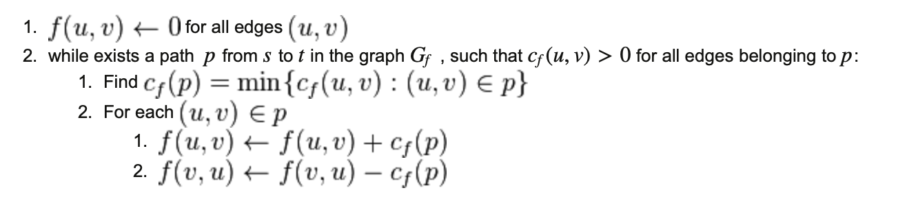

# LAB 2. Ford-Fulkerson Algorithm

In the following exrecises we use a graph to model a network flow (e.g., traffic flow, liquid flow, electric current flow etc.). To do this we consider a directed (a flow has some direction), weighted (particular segments of a network have some capacities) graph G=(V,E,c), where c stands for a capacity matrix such that for each pair of graph vertices (u,v)∈V×V a capacity (maximum flow) between u and v, c(u,w), is given (in other words, a maximum transfer allowed for a given "channel").  
If u and v are not connected  or transfer from  u to v is not possible then c(u,v)=0. We distinguish two graph vertices s,t∈V which denote the network flow source and target (also referred to as a sink) respectively.  

Now we ask the question: what is the maximum flow possible between a source (s) and a target (t). For water flow, for instance, it may be asked: how much liters of water can be pumped between s and t in one second? To answer this one has to launch the Ford-Fulkerson algorithm which pseudocode is given below.

[Exercise 1: Implement the following F-F algorithm pseudocode](exc1/):
  - FFA INPUT:
    - G=(V,E,c) - network graph
    - c:V×V→ℝ - network capacity matrix
    - s - source vertex
    - t - target vertex
  - FFA OUTPUT
    - f:V×V→ℝ - flow matrix
  - Remark: The graph Gf=(V,Ef,cf) used below is called a residual network, i.e., a graph such that  ∀(u,v)∈V×V:cf(u,v)=c(u,v)−f(u,v)>0. Gf contains all vertices of G and those edges of G for which a maximum flow has not been reached so far. The algorithm's performance is aimed at increasing flows f in G up to the moment when there is no path from s to t in a residual graph, i.e., no further flow growth is possible.

## Algorithm:

Ford–Fulkerson(G=(V,E,c),s,t)

[Exercise 2: Calculate maximum flow between vertices 10 and  60 of the](exc2/) [test graph](graf1.txt)  
[Exercise 3: For the same test graph  find a target vertex  for which the maximum flow from the source s=10
 is reached.](exc3/)
