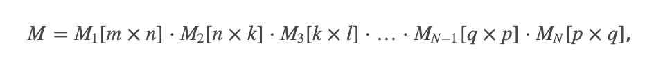
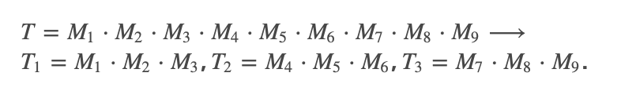

# LAB 5. Parallel Algorithms

## Instructions  

Implement the algorithm which computes in parallel a matrix product of N  matrices:  
  

where matrix sizes are given inside square brackets. The main task (T) i.e.,  multiplication of matrices, has to be split into subtask (T1,T2,…Tm) to be proceeded in parallel. For example:  


After completing T1,T2,T3, the algorithm proceeds with the main task, T.

## Implementation

is available in [matrices.py](matrices.py). It compares performance of sync and parallel solution with poor results on test dataset (parallel being an order of magnitude slower, meh).

```
'mul_all' - 5.507469177246094e-05 ms
'mul_all_p' - 0.05353212356567383 ms

'mul_all' - 0.0041391849517822266 ms
'mul_all_p' - 0.018925189971923828 ms
```
