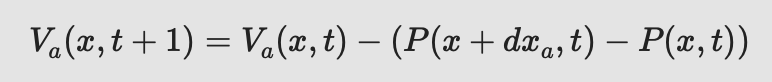
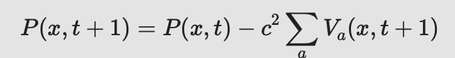

# Sound wave propagation

Fill missing fragments of code in class Board and Point.

[Exercise 1 - Sound wave simulation (3pkt)](exc1/src):
  - In class Point create 4 variables to store its north, south, east and west neighbor.
  - In class Board in method initialize(), initialize neighbors for each cell - use von Neuman neighborhood. Do not initialize the border cells.
  - In class Point create 4 variables that store particle velocity Va according to neighbor a, while a ∈ (N,W,S,E)
  - In method clear() write code that reset values of particle velocity and acoustic pressure
  - Implement method updateVelocity() according to equitation: 
  - while P(x,t) to acoustic pressure, and Va(x,t) is particle velocity in direction aa, at the moment tt, for cell at position defined by two values of vector xa
  - Implement method updatePresure() according to equitation: 
  - maximal wave velocity is defined as c, assume c^2=1/2
  - Run and test your simulation.

[Exercise 2 - Model extension by non-homogenious cellular automata - Walls(2 pkt)](exc2/src):
  - Walls(2 pkt) - In class Point add static array: `public static Integer []types ={0,1,2};` and variable `int type;`
  - You will use them to differentiate types of cells: air, wall, sound source (e.g. speakers)
  - In constructor of class Point set its default type to 0 (air).
  - In classes Board and GUI uncomment fragments of code that create drop-down list, which allows to choose and draw different cell types on the lattice.
  - In order to implement walls, one have prevent methods updatePresure() and updateVelocity() in cells of type different than 0 (air).

[Exercise 3 - Sources of sound (2 pkt)](exc3/src):
  - Source emits sound wave by changes of pressure in cell. In this exercise is recommended to use sinusoidal changes of pressure.
  - Add variable sinInput (type int) to class Point
  - In class Point in method updatePressure() if cell is type 2, its pressure should change according to following conditions:
```
double radians = Math.toRadians(sinInput);
pressure = (float) (Math.sin(radians));
```
  - Remember to change value of variable sinInput in each step of simulation.
  - How one can regulate the amplitude and frequency of emitted sound ?
