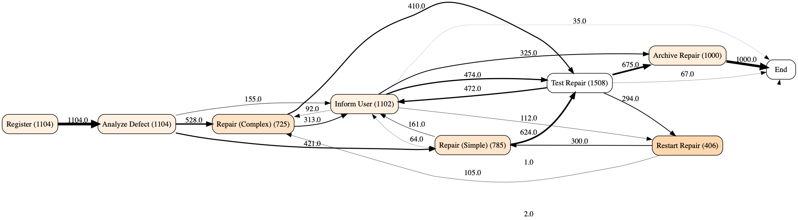
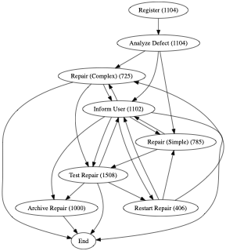

# Process mining in Python

This lab was about processing xes file with Python and plotting statistics regarding such process description  
  
The script dealing with this task can be found [here](script.py).  
It requires libs gathered in [requirements.txt](requirements.txt) file.  
File containing worklog is [repairexample.xes](repairexample.xes)  
  
Result should be as follows:

Just for fun, there is a gif version of these created with [script_anim.py](script_anim.py):

