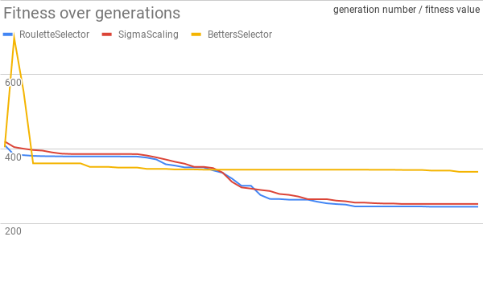

# EA - lab 2 - Selection methods

## Remarks
Change number of dimentions to 30.
Change the seed in AbstractRandGenFactory -> configure method (change to system time or sth).

## Actual lab contents
1. prepare your environment and run as in the first laboratory class, optimization of Rastrigin function
2. prepare the logging in order to easily retrieve the values of the fitness function depending on the generation
3. look into the contents of the net.sf.jclec.selector package
4. take a look at the code of several selectors - check in particlar the configure methods in order to see how the configuration parameters are read (compare TournamentSelector and RouletteSelector)
5. Learn how the following selectors work: `Betters selector`, `Random Selector`, `WorsesSelector`, `StochasticSelector`, `RouletteSelector`
6. Choose three of them and run the computing (at least repeat each run for 5 times) for Rastrigin computed in 30 dimensions
    - `RouletteSelector`
    - `SigmaScaling`
    - `BettersSelector`
7. Compare those selectors by drawing a graph (`std deviation` based or `box and whiskers`)  

Data is available [here](results.xlsx)
8. Modify the existing selector codes in order to implement your own selectors: 
    - a selector that chooses a medium individual (located around the center of the ranking), modify the Betters or Worse selector. Add this selector to comparison with others. **TODO**
    - a selector that chooses the best individual, but before returning it checks its distance (Euclidean - there’s a dedicated class for this EuclideanDistance -> IDistance) several times with other individuals, **TODO**
    - and if this distance is lower than certain threshold (a parameter read from CFG) the procedure is repeated for another randomly picked individual. add this selector to the comparison
An outcome of this laboratory will be a graph making possible comparison of different selection methods. **TODO**

