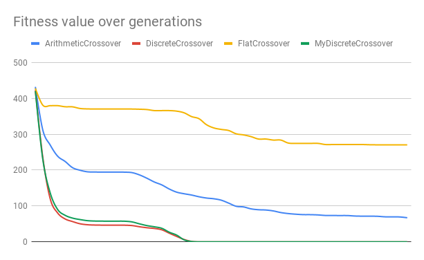

# Lab 3 - Crossovers

1. prepare your environment and run as in the first laboratory class, optimization of Rastrigin function

2. check the hierarchy of the crossover methods: 
  - `Uniform crossover`, 
  - `Uniform Crossover` 2x2 and 2x1, 
  - `Arithmetic crossover` (net.sf.jclec.reallarray.rec package)

3. Check the construction of the methods `RecombineLocus` and `RecombineNext`

4. [Compare the efficiency](data.xlsx) of the following crossovers, for Rastrigin (dimension 30):
  - `Arithmetic crossover`,
  - `Discrete crossover`, 
  - `Flat Crossover`.
  
5. [Implement Discrete Crossover](MyDiscreteCrossover.java) in a more popular manner: The parent is randomly chosen for each of the loci, the probability is 0.5 (Modify Discrete Crossover). Compare with the previous ones.

6. Implement OnePointCrossover for the Real Value Problems. Compare with the previous ones. **TODO**
7. Implement a crossover similar to the recombination operation from Differential Evolution: <https://en.wikipedia.org/wiki/Differential_evolution>, compare with the previous ones. **TODO**
