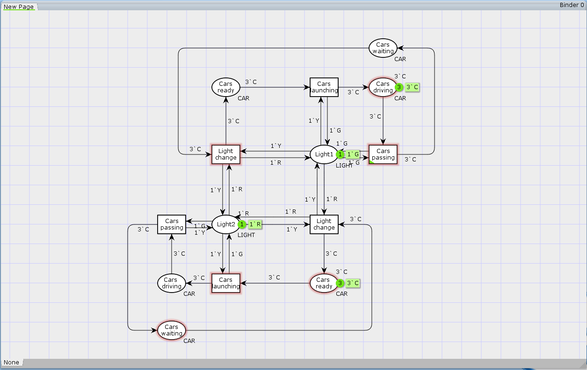

# Lab 2
## Traffic lights simulation using *colored* petri nets

## Exercise: Model traffic lights using colored petri nets, where:
  - traffic lights can be in 3 states "Red", "Yellow", "Green";
  - they can only transition in 2 different ways Red -> Yellow -> Green or Green -> Yellow -> Red
  - lights state should be represented by petri nets "colors" 
  - there is infinite line of cars waiting to cross sites
  - no more constraints I guess?

In team up with [Konrad](https://github.com/najder-k), we came up with something like this:
1. Easy way
2. Hard to read-and-understand-way

## Easy way
This one should be relatively easy to understand. There are two traffic lights (Light1 and Light2 places), they start with opposite tokens representing that one of them has RED light on (1\` R), and the other one has GREEN light on (1\` G).  
Cars passing transition exchanges 1 Green token for 1 Yellow token. It also takes 3 cars and produces another 3 cars.  
Light change transition exchanges 1 Yellow token for 1 Red token and 1 Red token for 1 Green. However, it can't exchange them separately, these two actions are happening simultaneously. 

## Hard way
todo

