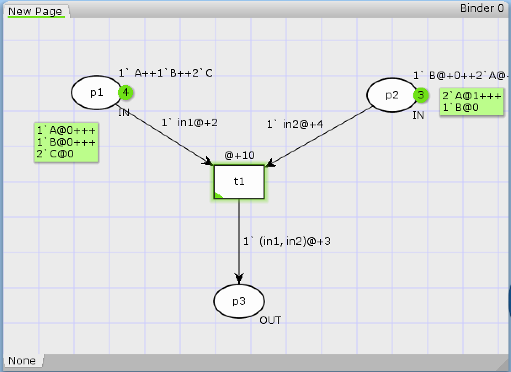
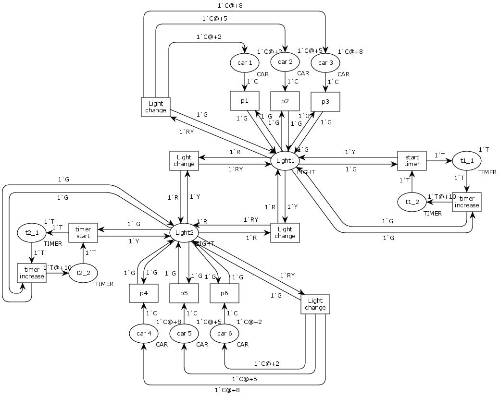

## TOC:
  - [example net using time](example.cpn)
  - [time based traffic lights CPN](time-based-traffic-lighrs.cpn)
  - [time based traffic lights EPS](time-based-traffic-lights.eps)

## Some pics presenting how it looks like:

### Example net using time:

### Traffic lights managed using time

